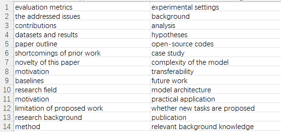
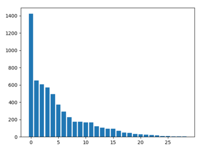

# DSciSum
Here is the proposed dataset of our paper "DSciSum: Detailed Summarization of Long Scientific Documents"

There are total 100 test examples, each has nine keys. The value of "pred_abs" is generated by our model, while "abs" represents existing reference.

For questionnaires, we collect topics that people are concerned about regarding certain paper from beginners, domain students and domain experts.

Results are shown as below, the first figure lists topics in descending order. "Evaluation metrics" ranks first while "relevant background knowledge" is the last. 
For the second figure, the vertical axis shows the number of the choice, while the horizontal axis represents the chosen topics according to their rank in figure1.

Figure1:
 

Figure2:

 

 
